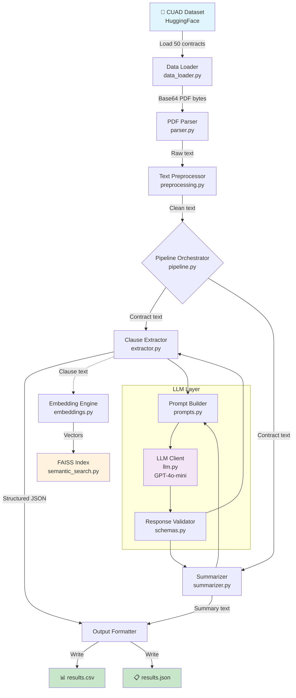

# Legal Contract Analysis Pipeline

> An end-to-end pipeline for analyzing legal contracts using Large Language Models. Extracts key clauses (termination, confidentiality, liability), generates concise summaries, and supports semantic search over extracted clauses.

## 📋 Table of Contents

- [Project Overview](#project-overview)
- [Architecture](#architecture)
- [Folder Structure](#folder-structure)
- [Installation](#installation)
- [Environment Variables](#environment-variables)
- [Running the Pipeline](#running-the-pipeline)
- [Output Format](#output-format)
- [Design Decisions](#design-decisions)
- [Prompt Engineering](#prompt-engineering)
- [Bonus: Semantic Search](#bonus-semantic-search)
- [Testing](#testing)
- [Challenges](#challenges)
- [Future Improvements](#future-improvements)

---

## Project Overview

This project implements a production-quality document processing pipeline that:

1. **Loads** 50 legal contracts from the [CUAD dataset](https://www.atticusprojectai.org/cuad) via HuggingFace
2. **Extracts** full text from PDFs using a dual-engine approach (PyMuPDF + pdfplumber fallback)
3. **Normalizes** text by cleaning Unicode, removing artifacts, and preserving paragraph structure
4. **Extracts clauses** (termination, confidentiality, liability) using GPT-4o-mini with structured JSON output
5. **Generates summaries** (100-150 words) covering purpose, obligations, and risks
6. **Outputs** results in both CSV and JSON formats
7. **(Bonus)** Builds a FAISS semantic search index over extracted clauses

---

## Architecture



---

## Folder Structure

```
contract-analysis-pipeline/
├── .env.example              # Environment variable template
├── .gitignore                # Git ignore rules
├── README.md                 # This file
├── requirements.txt          # Python dependencies
├── main.py                   # CLI entry point
│
├── config/
│   ├── __init__.py
│   └── settings.py           # Pydantic Settings configuration
│
├── src/
│   ├── __init__.py
│   ├── data_loader.py        # CUAD dataset loading from HuggingFace
│   ├── parser.py             # PDF text extraction (PyMuPDF + fallback)
│   ├── preprocessing.py      # Text normalization & cleaning
│   ├── prompts.py            # All prompt templates (few-shot, chunked)
│   ├── llm.py                # OpenAI client with retries & validation
│   ├── extractor.py          # Clause extraction logic
│   ├── summarizer.py         # Contract summarization
│   ├── schemas.py            # Pydantic models for I/O validation
│   ├── embeddings.py         # Sentence-transformers embedding engine
│   ├── semantic_search.py    # FAISS-based similarity search
│   ├── pipeline.py           # End-to-end orchestrator
│   └── utils.py              # Logging, token counting, chunking
│
├── data/                     # Auto-populated with downloaded data
├── outputs/                  # Generated CSV + JSON results
│
└── tests/
    ├── conftest.py           # Shared fixtures & sample data
    ├── test_parser.py        # PDF parsing tests
    ├── test_preprocessing.py # Text cleaning tests
    ├── test_schemas.py       # Schema validation tests
    ├── test_extractor.py     # Clause extraction tests (mocked LLM)
    ├── test_summarizer.py    # Summarization tests (mocked LLM)
    └── test_pipeline.py      # Integration tests
```

---

## Installation

### Prerequisites

- Python 3.11+
- An OpenAI API key ([get one here](https://platform.openai.com/api-keys))

### Setup

```bash
# Clone the repository
git clone https://github.com/<your-username>/contract-analysis-pipeline.git
cd contract-analysis-pipeline

# Create virtual environment
python -m venv .venv
source .venv/bin/activate        # Linux/macOS
# .venv\Scripts\activate         # Windows

# Install dependencies
pip install -r requirements.txt

# Configure environment
cp .env.example .env
# Edit .env and add your OPENAI_API_KEY
```

---

## Environment Variables

| Variable | Required | Default | Description |
|----------|----------|---------|-------------|
| `OPENAI_API_KEY` | ✅ | — | Your OpenAI API key |
| `LLM_MODEL` | ❌ | `gpt-4o-mini` | OpenAI model to use |
| `LLM_TEMPERATURE` | ❌ | `0.0` | Sampling temperature (0 = deterministic) |
| `LLM_MAX_RETRIES` | ❌ | `3` | Max retry attempts for malformed responses |
| `NUM_CONTRACTS` | ❌ | `50` | Number of contracts to process |
| `CHUNK_SIZE` | ❌ | `12000` | Max characters per chunk for long contracts |
| `EMBEDDING_MODEL` | ❌ | `all-MiniLM-L6-v2` | Sentence-transformer model |
| `LOG_LEVEL` | ❌ | `INFO` | Logging verbosity |

---

## Running the Pipeline

```bash
# Run full pipeline (50 contracts)
python main.py

# Process fewer contracts (quick test)
python main.py -n 5

# Disable few-shot examples
python main.py --no-few-shot

# Run with semantic search
python main.py --search "early termination without cause"

# Search-only mode (skip pipeline, use existing index)
python main.py --search-only --search "liability limitation"
```

### Expected Runtime

| Contracts | Approx. Time | Approx. Cost (gpt-4o-mini) |
|-----------|-------------|---------------------------|
| 5 | ~2 min | ~$0.05 |
| 50 | ~15-20 min | ~$0.50 |

---

## Output Format

### CSV (`outputs/results.csv`)

```csv
contract_id,summary,termination_clause,confidentiality_clause,liability_clause
Affiliate_Agreement__1,This agreement...,Either party may...,All information...,Liability is limited...
```

### JSON (`outputs/results.json`)

```json
[
  {
    "contract_id": "Affiliate_Agreement__1",
    "summary": "This agreement governs...",
    "termination_clause": "Either party may terminate...",
    "confidentiality_clause": "All Confidential Information...",
    "liability_clause": "IN NO EVENT SHALL..."
  }
]
```

Fields are `null` when a clause is not found in the contract.

---

## Design Decisions

### 1. Dual-Engine PDF Extraction

PyMuPDF is the primary engine (fast, reliable for most PDFs). pdfplumber serves as an automatic fallback for complex layouts. The parser selects the better result based on a character-count threshold.

### 2. Structured JSON Output via `response_format`

Instead of parsing freeform text, we use OpenAI's `response_format={"type": "json_object"}` combined with Pydantic schema validation. This ensures consistent, parseable output with automatic retry on malformed responses.

### 3. Token-Aware Chunking

Legal contracts can exceed 100 pages. The pipeline automatically detects when a contract exceeds the context window and switches to a chunk-and-merge strategy: extract clauses from each chunk independently, then use an LLM call to merge results.

### 4. Empty String → None Coercion

LLMs sometimes return `""` instead of `null` for absent clauses. The Pydantic schema includes a validator that converts empty/whitespace-only strings to `None`, preventing false positives.

### 5. Shared LLM Client

The extractor and summarizer share a single `LLMClient` instance to maintain consistent configuration and avoid redundant initialization.

### 6. Few-Shot Examples

The extraction prompt includes 3 carefully crafted few-shot examples demonstrating correct clause extraction and `null` handling. This significantly improves extraction accuracy and format consistency. Can be toggled via `--no-few-shot` for comparison.

---

## Prompt Engineering

### Techniques Used

| Technique | Where | Purpose |
|-----------|-------|---------|
| **Role Prompting** | System prompts | Establishes expert legal analyst persona |
| **Structured JSON Schema** | All prompts | Enforces predictable output format |
| **Delimiters** | `<CONTRACT>`, `<EXAMPLE>` | Clear input/output boundaries |
| **Few-Shot Examples** | Extraction prompt | Demonstrates expected format with nulls |
| **Anti-Hallucination Instructions** | System + user prompts | Explicit "return null, never fabricate" rules |
| **Chain-of-Thought (suppressed)** | System prompt | "Think step-by-step internally but only output JSON" |
| **Chunk Context** | Chunk prompts | Tells LLM which chunk it's analyzing |

### Prompt Design Principles

1. **Precision over recall** — Better to return `null` than hallucinate a clause
2. **Exact text extraction** — Prompts demand verbatim text, not paraphrasing
3. **Explicit schema** — JSON structure shown in every prompt
4. **Temperature 0.0** — Deterministic outputs for reproducibility
5. **Multiple validation layers** — JSON parsing → Pydantic validation → empty string coercion

---

## Bonus: Semantic Search

The pipeline includes a FAISS-based semantic search engine that:

1. Generates embeddings for all extracted clauses using `all-MiniLM-L6-v2`
2. Builds an inner-product index (cosine similarity on normalized vectors)
3. Persists the index to disk for reuse
4. Supports natural-language queries like "early termination rights"

```bash
# Build index during pipeline run and search
python main.py --search "indemnification obligations"

# Search existing index without re-running pipeline
python main.py --search-only --search "confidential information protection"
```

---

## Testing

```bash
# Run all tests
pytest tests/ -v

# Run with coverage
pytest tests/ -v --cov=src --cov-report=term-missing

# Run specific test file
pytest tests/test_parser.py -v
```

All LLM-dependent tests use mocked clients — **no API key required for testing**.

---

## Challenges

### 1. PDF Text Quality
Legal contracts come in many formats — multi-column layouts, scanned images, embedded tables. The dual-engine approach handles most cases, but some contracts produce suboptimal text. Future work could add OCR support.

### 2. Contract Length vs. Context Window
Some contracts exceed 100 pages. The chunk-and-merge strategy handles this, but merging introduces an extra LLM call and potential for information loss at chunk boundaries. The 500-character overlap mitigates but doesn't eliminate this.

### 3. Clause Ambiguity
Some contracts embed termination conditions inside broader sections (e.g., "General Provisions"). The prompt engineering addresses this by listing alternative section titles to look for.

### 4. LLM Output Consistency
Even with `temperature=0.0` and JSON mode, outputs occasionally vary. The retry logic and Pydantic validation provide resilience against this.

---

## Future Improvements

- **OCR Support**: Add Tesseract/Google Document AI for scanned contracts
- **Multi-Model Comparison**: Run extraction with GPT-4o, Claude, and Gemini side-by-side
- **Ground Truth Evaluation**: Compare extracted clauses against CUAD annotations for F1 scoring
- **Async Processing**: Use `asyncio` + `aiohttp` for concurrent LLM calls
- **Caching Layer**: Cache LLM responses to avoid re-processing on re-runs
- **Web UI**: Streamlit dashboard for interactive contract analysis
- **More Clause Types**: Extend to all 41 CUAD clause categories
- **Fine-Tuning**: Fine-tune a smaller model on CUAD annotations for cost reduction
